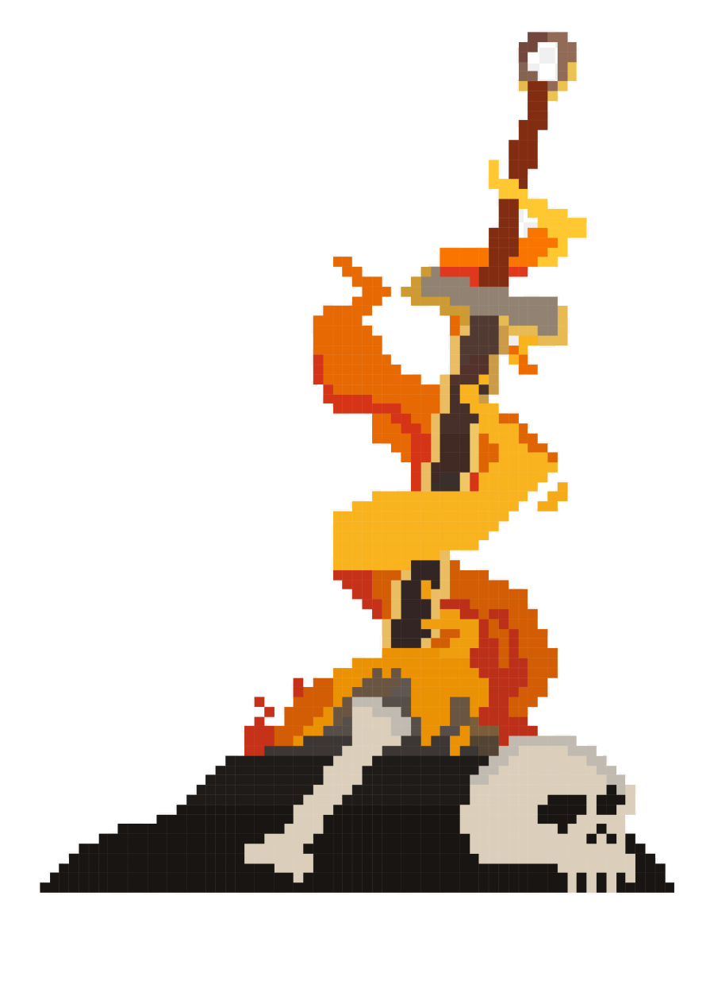

# Kulliyat - Souls-Like Boss Tracker (React Native)

<div align="center">
  
  <h3>Külliyat: Ruhların Günlüğü</h3>
  <p>Elden Ring, Sekiro, Bloodborne ve Dark Souls serileri için tasarlanmış gerçek zamanlı, co-op destekli gelişmiş Boss Takip Uygulaması.</p>
</div>

---

## 📌 Proje Özeti (IK / İşe Alım Uzmanları İçin)

**Kulliyat**, Souls-like oyun kültürünü ve "Dark Fantasy" atmosferini yansıtan; performans, UI/UX ve sistem mimarisi açısından sektörel standartlarda geliştirilmiş bir **React Native (Expo)** mobil uygulamasıdır. 

Sıradan bir "To-Do" uygulamasının çok ötesine geçerek; **Firebase Firestore** ile gerçek zamanlı (real-time) veri senkronizasyonu, akıcı **60 FPS Reanimated** animasyonları, **Haptic Feedback** (Titreşim Sistemi) destekli etkileşimler ve cihazlar arası **P2P Co-op (Ruh Çağırma)** sistemleri barındırır.

### ✨ Öne Çıkan Mühendislik & UX Çözümleri

- **Gerçek Zamanlı Co-op Mimarisi (Ruh Çağırma):**
  - Uygulama, Firebase altyapısı kullanarak kullanıcıların benzersiz bir "Mühür Kodu" (PIN) ile farklı cihazlardaki avcıların dünyalarına **"Gözlemci" (Salt Okunur)** veya **"Yoldaş" (Yazma İzinli)** rolleriyle bağlanmasına olanak tanır.
  - *Mimari Kazanım:* Rol tabanlı yetkilendirme (RBAC) ve cihazlar arası gerçek zamanlı veri senkronizasyonu (Real-time NoSQL).

- **Ultra Yüksek Performanslı Listeleme:**
  - Onlarca hatta yüzlerce Boss kartının aynı anda renderlanması sonucu oluşan performans kaybı (Memory Leak/Lag), React Native'in `SectionList` ve `FlatList` mimarileri optimize edilerek çözülmüştür.

- **Optimistic UI & Haptic Feedback:**
  - Kullanıcı bir Boss'a hasar verdiğinde (Öldün/Kesildi işaretlediğinde), uygulamanın veritabanı yanıtını beklemesine gerek yoktur. **Optimistic UI** yaklaşımı sayesinde işlem anında ekrana yansır, `Reanimated` ile görsel zıplama efekti tetiklenir ve `expo-haptics` ile fiziksel bir geri bildirim verilir.
  - *Mimari Kazanım:* Sıfır gecikme (Zero-latency) hissi ve üst düzey kullanıcı deneyimi.

- **Modern ve Modüler Tasarım Sistemi:**
  - `NativeWind` (TailwindCSS) entegrasyonu ile stil kodları modüler hale getirilmiş, bileşenler (Components) tamamen yeniden kullanılabilir (Reusable) mimaride inşa edilmiştir.

---

## 🛠️ Kullanılan Teknolojiler (Tech Stack)

| Kategori | Teknoloji | Kullanım Amacı |
| :--- | :--- | :--- |
| **Framework** | **React Native (Expo)** | iOS ve Android için çapraz platform (Cross-platform) mobil geliştirme. |
| **Veritabanı** | **Firebase (Firestore)** | Gerçek zamanlı (Real-time) NoSQL veri tabanı, State senkronizasyonu. |
| **Stil & Tasarım** | **NativeWind (Tailwind)** | Hızlı, tutarlı ve responsive arayüz (UI) tasarımı. |
| **Animasyonlar** | **Reanimated 3** | Akıcı (60 FPS) geçişler ve fizik motoru destekli mikro animasyonlar. |
| **Jestler & Kontrol** | **Gesture Handler** | Swipe-to-delete (Sağa sola kaydırma) ve gelişmiş dokunmatik etkileşimler. |
| **Geri Bildirim** | **Expo Haptics** | Dokunma hissi ve titreşim motoru entegrasyonu. |

---

## 🚀 Temel Özellikler

- **Boss Veritabanı:** 120'den fazla sisteme kayıtlı Boss adı, otomatik oyun tespit (Auto-detect) algoritması. (Yanlış oyunlara yanlış boss eklenmesini engelleyen güvenlik önlemleri).
- **Akıllı Filtreleme:** Oyun bazlı dinamik sekmeler, tamamlanmış (Kesilenler) ve aktif (Mücadele Edilenler) kayıtlarının otomatik ayrıştırılması.
- **Swipe-to-Action:** Kartları sağa kaydırarak silme, sola kaydırarak anında "Ölüm" ekleme.
- **Karanlık Tül (Dark Overlay) Arayüz:** Göz yormayan, oyunların karanlık atmosferine uygun transparan geçişli (Transparent Modal) modern menüler.

---

## 📁 Proje Kurulumu (Geliştiriciler İçin)

> Projede Firebase kullanıldığı için veritabanı bağlantılarının (.env.local) yapılandırılması gerekmektedir. Güvenlik sebebiyle API anahtarları `.gitignore` içerisindedir.

```bash
# 1. Bağımlılıkları Yükleyin
npm install

# 2. Ortam Değişkenlerini Ayarlayın
# Kök dizine '.env.local' dosyası oluşturun ve Expo Firebase keylerinizi girin.

# 3. Uygulamayı Başlatın (Expo Metro Bundler)
npx expo start --clear
```

---

*Bu proje, modern bir mobil uygulamanın state yönetiminden, animasyon süreçlerine ve veri senkronizasyonuna kadar olan yaşam döngüsünü (Lifecycle) eksiksiz ve performanslı bir şekilde yönetebilme yeteneğini göstermek amacıyla geliştirilmiştir.*
